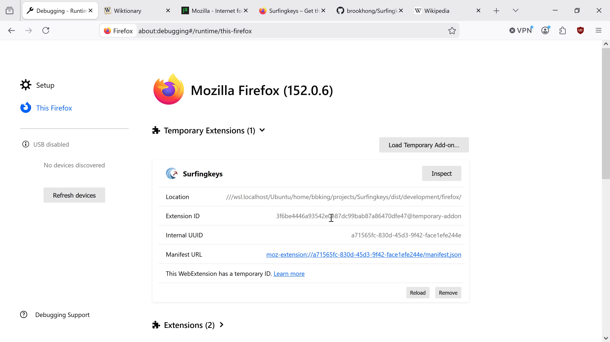
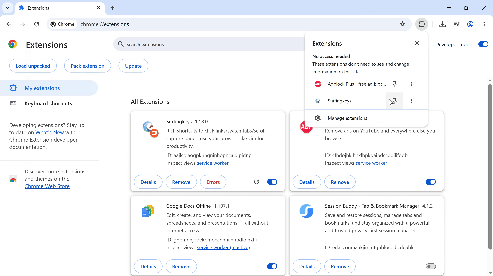
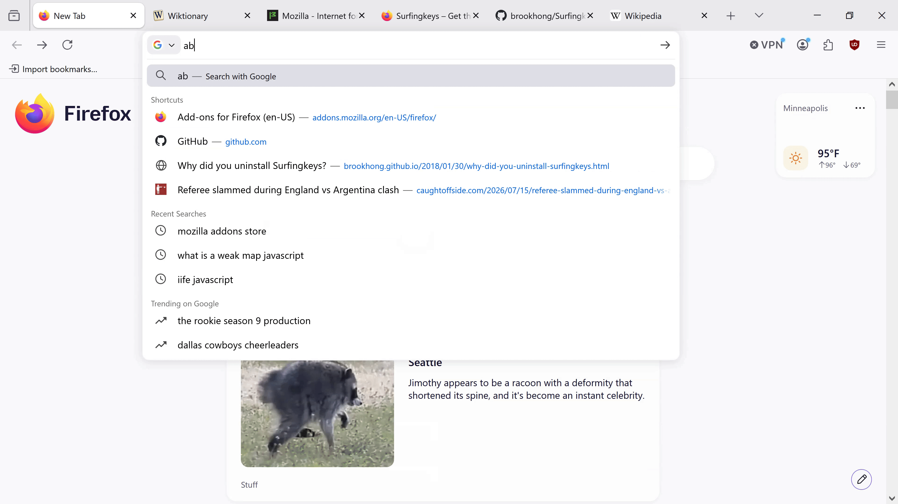
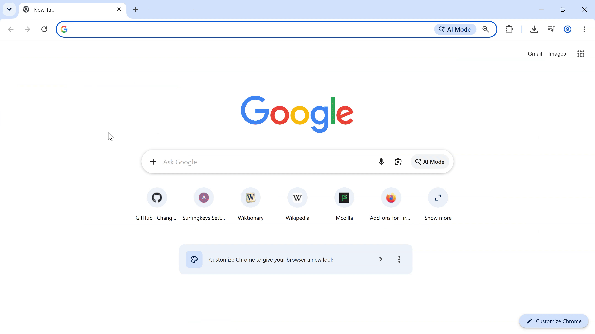

Thank you for your interest in contributing to this project.

## Reporting issues

#### Select "Report an Issue" from the extension's dropdown menu

<details>
<summary>  click to show/hide screenshots</summary>
<table>
    <tr><th>Mozilla Firefox</th><th>Google Chrome</th></tr>
    <tr>
        <td></td>
        <td></td>
    </tr>
</table>
</details>

#### or use the template below

```
## Error details

SurfingKeys: 0.9.22

Browser: Mozilla/5.0 (Macintosh; Intel Mac OS X 10.12; rv:57.0) Gecko/20100101 Firefox/57.0

URL: <The_URL_Where_You_Find_The_Issue>

## Context

**Please replace this with a description of how you were using SurfingKeys.**
```

## Build

|                                      |                                       |
| ------------------------------------ | ------------------------------------- |
| `npm install`                        | `# set up environment`                |
| `npm run build:prod`                 | `# build extension`                   |
| `browser=firefox npm run build:prod` | `# build extension for firefox`       |
| `npm run build:dev`                  | `# build development version`         |
| `browser=firefox npm run build:dev`  | `# build firefox development version` |

## Load Extension

### Google Chrome

To load the extension:

1. Build using npm.
2. Open the browser's extension page.
    - For Chrome, this can be accessed through "chrome://extensions".
3. Disable the Surfingkeys extension that was installed from the Google Chrome Store.
4. Enable "Developer mode" then click "Load unpacked."
    - For versions prior to v1.x, navigate to `<pathToSurfingkeys>/dist/Chrome-extensions`
    - For version v1.x, navigate to `<pathToSurfingkeys>/dist/<env>/<browser>`.

### Mozilla Firefox

To load the extension:

1. Build your desired version of the extension using npm.
2. Open the browser's extension page `about:debugging`
3. Disable any other installed versions of Surfingkeys
    - i.e. any other test versions or the [official Mozilla Addon](https://addons.mozilla.org/en-US/firefox/addon/surfingkeys_ff/).
    - Consider creating a new browser profile to be able to select what extensions you want installed (if any) besides Surfingkeys in your testing.
    - This can be done in `about:profiles`

4. Load the extension by clicking "Load Temporary Add-on..."
   and select the `manifest.json` from the extension build generated in the first step.
    - For version v1.x, navigate to `<pathToSurfingkeys>/dist/<env>/<browser>`.

### screenshots

<details open>
<summary>  click to show/hide screenshots</summary>
<table>
    <tr><th>Mozilla Firefox</th><th>Google Chrome</th></tr>
    <tr>
        <td></td>
        <td></td>
    </tr>
</table>
</details>
